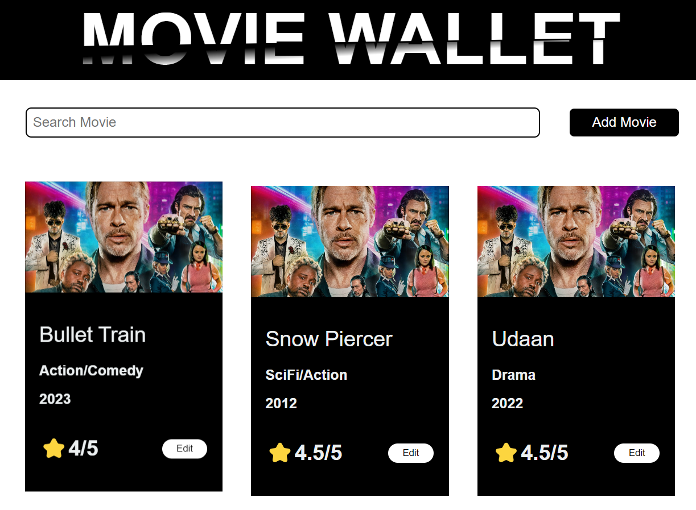

This is a full stack application that stores users favorite movies so that they can view it any times from anywhere. The application has been designed using **NextJS** for the front-end, **Apollo Graphql** as an API, and **MongoDB** to perform **CRUD** operations using mongoose.

**To use this repository:**

1. You can simply clone it and run `npm install` in both client and server directories.
2. After then, you can use nodemon to start the server and run the application on the frontend.
3. On the server side, use `npm run dev`
4. On the client side, use `npm run dev`

> Please feel free to use or modify it freely. Happy Coding!!
